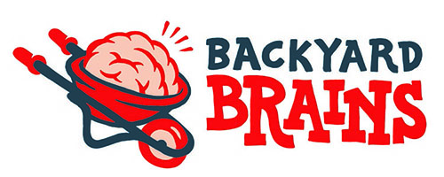

---
# latest project number
sidebar_position: 
# project title
sidebar_label: Project Title
# short project description
description: short project description
---

# Project Title #


|     |       |
|--------------|--------------
| Inventor     | "Inventor's name"            
| micro:bit IDE| "MakeCode editor" or "Python Editor"
| Best Used    | "Classroom", "Individual Project", "Entertainment", etc.

#### Difficulty ####

|     |       |
|--------------|--------------
| Hardware     | 1/5           
| Software     | 1/5


#### Special Requirement ####
|     |       |
|--------------|--------------
| Glue Gun, 3D Printer, Full rotationServo, etc.   | "Required" or "Recommended"

## Background ##
Talk about the project here. Consider to add:
- what is it?
- how does it work?
- why building?

## Build Instructions ##


Paste picture of all materials here and add any description here if necessary.

### 1. Title for first step ###


add detail explanation for step 1 here.

### 2. Title for second step ###


add detail explanation for step 2 here.

### 3. Title for third step ###


add detail explanation for step 3 here.

### Add more build instruction if necessary ###


add detail explanation for each extra steps here.

## Code ##

Add description of code here in detail. Consider adding brief explanation to WHY the code works.

Note:
If the project uses spikerBit extension, guide them to our SpikerBit extension tutorial page. (currently building)

import Tabs from '@theme/Tabs';
import TabItem from '@theme/TabItem';

<Tabs>
  <TabItem value="Block" label="Block Code">

  

  </TabItem>

  <TabItem value="Python" label="Python" default>

  ```py title="DIY Hand Neuroprosthetic"
  # Add python code here
  ```
  </TabItem>

  <TabItem value="Js" label="Js">

  ```py title="DIY Hand Neuroprosthetic"
  # Add javaScript code here
  ```
  </TabItem>
</Tabs>

## Operating Instructions ##


Write how to operate the projects. For example, if the project is based on game, write down instructions here.
